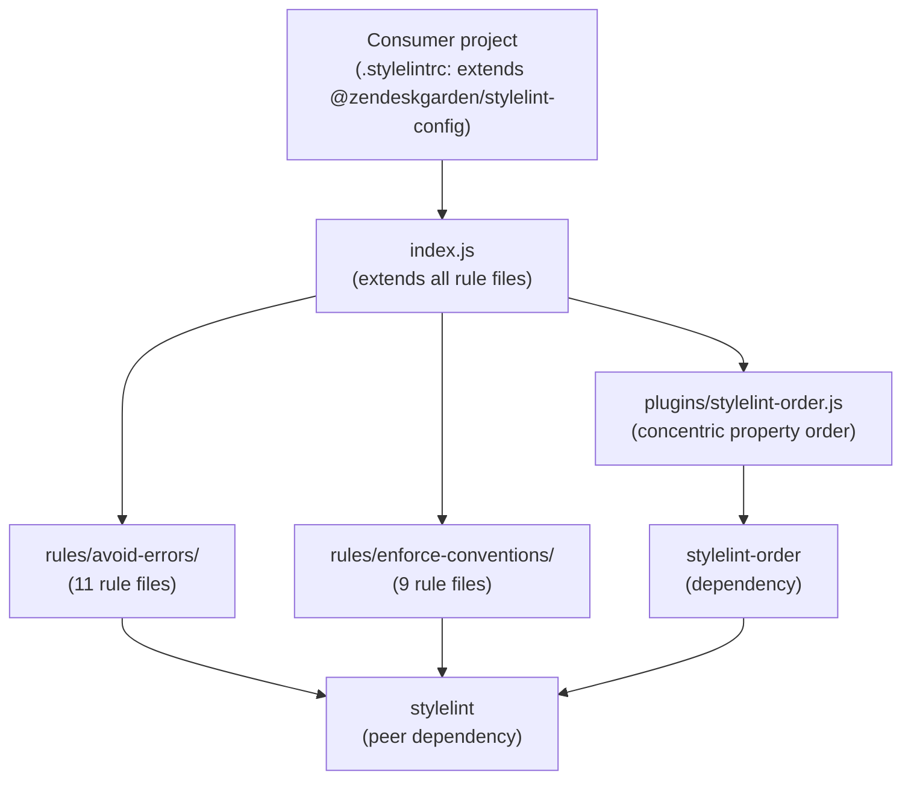

# Garden stylelint Config — Architecture

## System Overview

`@zendeskgarden/stylelint-config` is a **shareable stylelint configuration package** published to npm as `@zendeskgarden/stylelint-config`. Consumers install it and point their `.stylelintrc` at it via the `extends` property. The package itself has no build step — it is pure JavaScript configuration objects consumed directly by stylelint at lint time.

## Architecture Diagram

## Component Map

| Path | Responsibility |
|------|----------------|
| `index.js` | Single entry point; extends all rule files and sets `reportNeedlessDisables: true` |
| `rules/avoid-errors/` | Rules that prevent invalid or erroneous CSS (unknown, deprecated, duplicate, invalid, etc.) |
| `rules/enforce-conventions/` | Rules that enforce Garden's CSS style conventions (naming, notation, ordering hints, quoting) |
| `plugins/stylelint-order.js` | Concentric property-sort-order plugin config |

### Rule File Groupings

**`rules/avoid-errors/`** (11 files — one concern per file):

| File | Concern |
|------|---------|
| `deprecated.js` | Deprecated at-rules, properties, media types, keyword values |
| `descending.js` | Descending specificity |
| `duplicate.js` | Duplicate selectors, properties, font names, imports |
| `empty.js` | Empty blocks, source, keyframes |
| `invalid.js` | Invalid position declarations, at-rule preludes, syntax strings, missing scoping roots |
| `irregular.js` | Irregular whitespace |
| `missing.js` | Missing generic font families, required grid areas |
| `non-standard.js` | Non-standard direction values, box-sizing |
| `overrides.js` | Properties overridden by shorthand on the same line |
| `unknown.js` | Unknown rules, properties, values, functions, units, pseudo-classes/elements |
| `unmatchable.js` | Unmatchable `@keyframes` selectors, `::after` pseudo-element selectors |

**`rules/enforce-conventions/`** (9 files):

| File | Concern |
|------|---------|
| `allowed-disallowed-required.js` | Vendor prefix bans, named-color ban, `!important` ban, url scheme allowlist |
| `case.js` | Lowercase for function names, type selectors, keyword values |
| `empty-lines.js` | Required empty lines before `@rules` and rules |
| `max-min.js` | Maximum specificity / nesting depth limits |
| `notation.js` | Short hex, numeric font-weight, modern color functions, `string` import notation |
| `pattern.js` | Naming: `zd-.+` for custom properties, custom media, and keyframe names |
| `quotes.js` | Quote conventions for font families, urls, attribute values |
| `redundant.js` | Redundant longhand / shorthand values |
| `whitespace-inside.js` | Whitespace inside comment markers |

## Key Design Decisions

### Single Entry Point with Composable Rule Files
`index.js` uses stylelint's `extends` array to compose focused rule files rather than putting all rules in one file. This makes the config easy to audit by concern — each file is a single logical category.

### One Rule Per File Principle
Each file addresses exactly one concern (e.g., `duplicate.js` handles all duplicate-related rules). This makes changes easy to review and keeps diffs minimal when rules are updated.

### Intentional `null` Values
Rule entries set to `null` are explicitly unconfigured rather than absent — this documents that the rule was considered and intentionally left to consumers to configure if needed.

### `reportNeedlessDisables: true`
Enabled globally in `index.js` so that stale `/* stylelint-disable */` comments in consumer code are surfaced as errors, preventing suppress-and-forget patterns.

### No Build Step
The package ships raw JS `module.exports` objects. There is no transpilation, no bundling — what's in the repo is exactly what's published to npm.

### Naming Conventions Enforced (`zd-.+`)
Custom properties, custom media queries, and keyframe animation names must match `zd-.+`. This namespaces Garden's tokens and prevents accidental clashes with consumer code.

## External Dependencies

| Dependency | Type | Purpose |
|------------|------|---------|
| `stylelint` | peer | Core linter that reads this config |
| `stylelint-order` | production | Enables `order/properties-order` for concentric CSS sorting |
| `@zendeskgarden/eslint-config` | dev | ESLint config used to lint this repo's own JS files |
| `prettier-package-json` | dev | Formats `package.json` |
| `commit-and-tag-version` | dev | Generates CHANGELOG and tags releases |
| `husky` | dev | Runs lint + format as a pre-commit hook |

## Cross-Cutting Concerns

### Versioning
Follows semantic versioning. Major versions are cut when rules are added or changed in ways that would fail previously-passing CSS. Use `npm run tag` on `main` to cut a release.

### CI / Pre-commit
The pre-commit hook (via husky) runs `npm run lint && npm run format`. The `npm test` script adds a `git diff --quiet` check to ensure formatting is committed.

### Publishing
Publishes to npm under `@zendeskgarden` scope with `"access": "public"`. Only `plugins/` and `rules/` are included in the published package (plus `index.js` as `main`).
